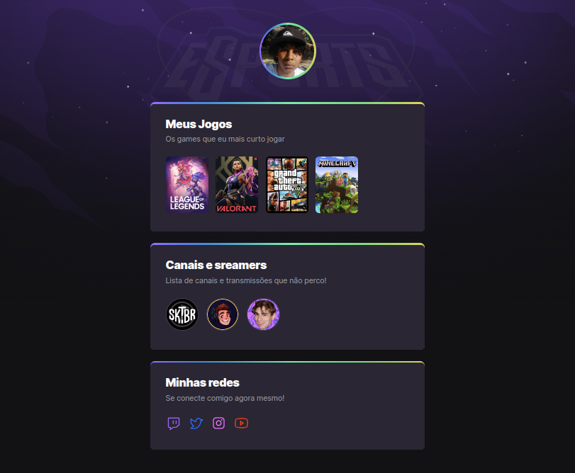

# NLW eSports 
> Trilha Explorer

Projeto construído do evento Next Level Week
da Rockeatseat.

[🔗Clique aqui para acessar](https://atilacsilva.github.io/Nlw-eSports) 

## 🚀 Tecnologias 

- HTML
- CSS
- Git e Github

### ✍️ O que aprendi!
Nessa semana de Next Level Week, aprendi muito sobre CSS e HTML, todavia mais doque isso. Entendi o que um Dev precisa para se tornar um profissonal qualificado, além de aprendizados que vão além da técnica💻